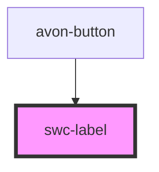

# swc-label

<!-- Auto Generated Below -->

## Properties

| Property     | Attribute    | Description | Type     | Default     |
| ------------ | ------------ | ----------- | -------- | ----------- |
| `color`      | `color`      | color       | `string` | `"black"`   |
| `fontfamily` | `fontfamily` | font-family | `string` | `"Arial"`   |
| `fontsize`   | `fontsize`   | font-size   | `string` | `"12px"`    |
| `label`      | `label`      | Label       | `string` | `undefined` |

## Dependencies

### Used by

 - [avon-button](../avon-button)

### Graph

----------------------------------------------

*Built with [StencilJS](https://stenciljs.com/)*
