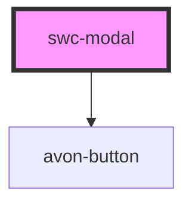

# swc-modal

<!-- Auto Generated Below -->

## Properties

| Property          | Attribute         | Description       | Type                                                 | Default                 |
| ----------------- | ----------------- | ----------------- | ---------------------------------------------------- | ----------------------- |
| `btncolor`        | `btncolor`        | Button color      | `"clear" \| "light" \| "primary" \| "secondary"`     | `'secondary'`           |
| `buttonlabel`     | `buttonlabel`     | button-label      | `string`                                             | `"Go back to shopping"` |
| `height`          | `height`          | height            | `string`                                             | `"100%"`                |
| `modaltitle`      | `modaltitle`      | Heading           | `string`                                             | `"Modal title"`         |
| `open`            | `open`            | open              | `boolean`                                            | `false`                 |
| `position`        | `position`        | Position of modal | `"bottom" \| "center" \| "left" \| "right" \| "top"` | `'right'`               |
| `titlecolor`      | `titlecolor`      | Title color       | `string`                                             | `"black"`               |
| `titlefontfamily` | `titlefontfamily` | Title font-family | `string`                                             | `"Montserrat,Arial"`    |
| `titlefontsize`   | `titlefontsize`   | Title font-size   | `string`                                             | `"18.72px"`             |
| `titlefontweight` | `titlefontweight` | Title font-weight | `string`                                             | `"100"`                 |
| `width`           | `width`           | width             | `string`                                             | `"300px"`               |

## Events

| Event      | Description | Type               |
| ---------- | ----------- | ------------------ |
| `btnClick` |             | `CustomEvent<any>` |

## Dependencies

### Depends on

- [avon-button](../avon-button)

### Graph

----------------------------------------------

*Built with [StencilJS](https://stenciljs.com/)*
